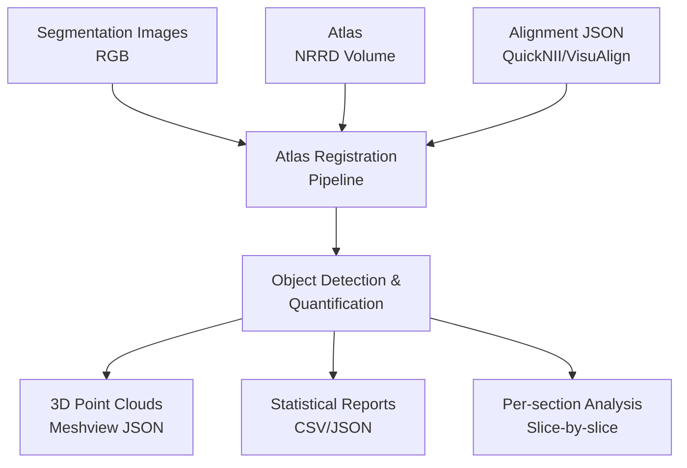

# webnutil-service

[](https://www.python.org/downloads/)
[](LICENSE)

A high-performance Python library for spatial analysis of histological brain sections using a reference brain atlases. Webnutil-service implements the core quantification algorithms from the [QUINT workflow](https://quint-workflow.readthedocs.io/en/latest/), designed to replicate and extend the Quantifier feature of Nutil software (RRID: SCR_017183).

## Overview

Webnutil-service performs automated spatial quantification of labeled structures in brain tissue sections by:

**Object Detection**: Identifying connected components in segmented images using advanced image processing.

**Atlas Registration**: Mapping detected objects to standardized brain atlas coordinates.

**Spatial Quantification**: Computing region-wise statistics including object counts, areas, and density metrics.

**3D Visualization**: Generating point clouds for interactive exploration in atlas space.

## Inputs

The service requires two primary inputs:

### 1. Atlas Registration Data

- **Format**: `series_abc_registration.json/waln` from QuickNII, VisuAlign, WebAlign, or WebWarp.
- **Content**: Linear and non-linear transformation parameters, anchoring vectors, slice metadata.

### 2. Segmented Images

- **Format**: RGB images with unique color codes for labeled structures with names matching registration section numbers e.g. _s005
- **Requirements**: Consistent pixel intensities for target structures.
- **Supported**: Standard image formats (PNG, JPEG, TIFF) and DZI archives in .dzip zip stored format.

## Output Products

- **Quantification Reports**: Region-wise statistics in CSV/JSON format.
- **3D Point Clouds**: Atlas-space coordinates for visualization in MeshView or other PointCloud visualizers.
- **Per-section Analysis**: Slice-by-slice analysis results.
- **Hemispheric Statistics**: Left/right brain region comparisons.
- **WIP Slice regions visualizations**

## Installation

### Requirements

#### Nutil Module Requirements

- Python 3.9+
- NumPy
- OpenCV
- scikit-image
- pandas

#### Server Requirements

- FastAPI
- Redis

### Quick Install

```bash
git clone https://github.com/your-org/webnutil-service.git
cd webnutil-service
pip install -r requirements.txt
pip install -r api_requirements.txt
pip install -r ui/requirements.txt (optional)
```

## Quick Start

To set up and start the UI
```bash
run_ui.ps1
```

To start as a deployment
```bash
docker compose up -d
# Creates the API, worker and a redis pod
```

### Expected usage with the Nutil module

```python
from nutil import Nutil

# Initialize the analysis
nt = Nutil(
    segmentation_folder="./segmentations/",
    alignment_json="./alignment.json",
    colour=[255, 0, 0],  # Target RGB color
    atlas_path="./atlas/annotation_25.nrrd",
    label_path="./atlas/labels.csv"
)

# Extract coordinates and quantify
nt.get_coordinates(object_cutoff=10, use_flat=False)
nt.quantify_coordinates()

# Get results as a pandas DataFrame 
results = nt.get_region_summary()
print(results.sort_values(by="object_count", ascending=False))
```

### Advanced Configuration

```python
# With hemispheric analysis and damage assessment made in QuickNII
nt = Nutil(
    segmentation_folder="./data/segmentations/",
    alignment_json="./data/alignment_with_grid.json",
    colour=[0, 255, 0],
    atlas_path="./atlases/allen_2017_25um.nrrd",
    label_path="./atlases/allen_labels.csv",
    hemi_path="./atlases/hemisphere_mask.nrrd"
)

nt.get_coordinates(
    object_cutoff=5,        # Minimum object size (pixels)
    use_flat=False,         # Use 3D atlas (not flat files)
    apply_damage_mask=True  # Include damage analysis
)

# Quantification with custom regions
nt.quantify_coordinates()

# Export results
nt.save_analysis_output(
    output_folder="./results/",
    prepend="experiment_1_"
)
```

### Output Structure

```
results/
├── whole_series_report/
│   ├── experiment_1_whole_series_report.csv    # Aggregated statistics
│   └── experiment_1_settings.json              # Analysis parameters
├── per_section_reports/
│   ├── experiment_1_XYZ_s001_report.csv     # Per-slice breakdown
│   └── experiment_1_XYZ_s002_report.csv
├── whole_series_meshview/                      # Meshview compatible point clouds
│   ├── experiment_1_pixels.json                # 3D point cloud (pixels)
│   └── experiment_1_centroids.json             # 3D point cloud (centroids)
└── per_section_meshview/
    ├── experiment_1_XYZ_s001_pixels.json    # Section-specific clouds
    └── experiment_1_XYZ_s001_centroids.json
```

## Technical

### Atlas Registration and Coordinate Transformations

The system implements a multi-stage coordinate transformation pipeline to map 2D histological sections to 3D atlas space:

#### 1. Registration Space Scaling

For a segmentation of dimensions $(H_{seg}, W_{seg})$ and registration dimensions $(H_{reg}, W_{reg})$:

```math
s_y = \frac{H_{reg}}{H_{seg}}, \quad s_x = \frac{W_{reg}}{W_{seg}}
```

Pixel coordinates $(y, x)$ are scaled to registration space:

```math
(y', x') = (y \cdot s_y, x \cdot s_x)
```

#### 2. Non-linear Deformation (Optional)

When non-linear corrections are present, coordinates undergo triangular mesh-based transformation using Delaunay triangulation with marker-based deformation fields.

#### 3. Atlas Space Transformation

Transformation to 3D atlas coordinates using QuickNII anchoring vectors. For coordinates in the valid range $x' \in [0, W_{reg}-1]$ and $y' \in [0, H_{reg}-1]$:

```math
\begin{pmatrix} X \\ Y \\ Z \end{pmatrix} = \mathbf{o} + \frac{x'}{W_{reg}} \mathbf{u} + \frac{y'}{H_{reg}} \mathbf{v}
```

Where:

- $\mathbf{o}$ = origin vector (3D voxel coordinates of top-left corner)
- $\mathbf{u}$ = horizontal axis vector (3D voxel coordinates of horizontal edge)
- $\mathbf{v}$ = vertical axis vector (3D voxel coordinates of vertical edge)
- $W_{reg}, H_{reg}$ = registration image width and height in pixels

### Object Detection and Region Assignment

#### Connected Component Analysis

Objects are identified using **scikit-image's measure.label** with 1-connectivity, accepting adjacent structures with no gaps:

```python
labels = measure.label(binary_segmentation, connectivity=1)
objects = measure.regionprops(labels)
```

For each detected object $O_i$:

- **Centroid**: $c_i = \frac{1}{|O_i|} \sum_{p \in O_i} p$
- **Area**: $A_i = |O_i|$ (pixel count)
- **Bounding region**: Determined by pixel coordinates

#### Region Assignment Strategy

Objects are assigned to atlas regions using **majority voting**:

```math
R(O_i) = \arg\max_{r} |\{p \in O_i : \text{atlas}(p) = r\}|
```

### Area Splitting and Pixel-Level Quantification

**Implementation Status**: **Validated**

Pixel-level area splitting, ensuring accurate quantification when objects span multiple regions:

```math
\text{pixel\_count}_{r} = \sum_{i} |\{p \in O_i : \text{atlas}(p) = r\}|
```

```math
\text{area\_fraction}_{r} = \frac{\text{pixel\_count}_{r}}{\text{region\_area}_{r}}
```

### Region Area Calculation

Atlas regions are mapped to segmentation space and areas calculated as:

```math
\text{region\_area}_{r} = \sum_{p} \mathbf{1}[\text{atlas}(p) = r]
```

**Known Scaling Issue**: When segmentations are larger than registration images, region areas **can** differ from Nutil. Nutil applies a global scaling factor, while webnutil-service resizes atlas maps using nearest-neighbor interpolation to preserve region label integrity.

\*_under investigation_

### Performance

- Binary mask generation: O(HW) (Optional)
- Connected component labeling: O(HW α(HW))
- Region assignment: O(n) where n = number of objects

**Overall Complexity**: O(HW α(HW)) where α is [the inverse Ackermann function](https://en.wikipedia.org/wiki/Ackermann_function#Inverse)

_HW refers to the image resolution_

### Validation Status

| Component                 | Status                  | Notes                                             |
| ------------------------- | ----------------------- | ------------------------------------------------- |
| Atlas map creation        | Validated               | Matches VisuAlign output for test datasets        |
| Object detection          | Validated               | Object counts match output for test datasets      |
| Area splitting            | Validated               | Pixel-level accuracy confirmed                    |
| Area fractions            | Validated               | Mathematical correctness verified                 |
| Coordinate transformation | Validated               | 3D atlas space mapping accurate                   |

**Reference**: Atlas validation documented in [PyNutil Issue #38](https://github.com/Neural-Systems-at-UIO/PyNutil/issues/38)

## Architecture Overview

### Core Components



## API Reference

### Core Classes

#### `Nutil`

Main analysis class providing the complete quantification pipeline.

**Constructor Parameters:**

- `segmentation_folder` (str): Path to directory containing segmentation images
- `alignment_json` (str): Path to QuickNII/VisuAlign alignment file
- `colour` (List[int]): RGB color triplet for target structures [R, G, B]
- `atlas_path` (str): Path to 3D atlas volume (.nrrd file)
- `label_path` (str): Path to atlas labels CSV file
- `hemi_path` (str, optional): Path to hemisphere mask volume
- `custom_region_path` (str, optional): Path to custom region definitions

**Key Methods:**

- `get_coordinates(object_cutoff=0, use_flat=False, apply_damage_mask=True)`: Extract and transform coordinates
- `quantify_coordinates()`: Perform statistical quantification
- `get_region_summary()`: Return aggregated results DataFrame
- `save_analysis_output(output_folder, prepend="")`: Export all results

### Statistical Outputs

#### Region Summary Columns

| Column          | Description                 | Units   |
| --------------- | --------------------------- | ------- |
| `idx`           | Atlas region ID             | -       |
| `name`          | Region name                 | -       |
| `region_area`   | Total region area           | pixels  |
| `object_count`  | Number of detected objects  | count   |
| `pixel_count`   | Total labeled pixels        | pixels  |
| `area_fraction` | Labeled area / total area   | ratio   |
| `left_hemi_*`   | Left hemisphere statistics  | various |
| `right_hemi_*`  | Right hemisphere statistics | various |

_the damaged and undamaged sections will be implemented in the future_

## Performance Considerations

### Benchmarks

Based on actual test runs with DZI-compressed brain sections (Allen Mouse Atlas 2017 on ttA_NOP dataset):

| Image Size | Objects Detected | Processing Time | Memory Peak |
| ---------- | ---------------- | --------------- | ----------- |
| 5282×3804  | 5,655            | 1.8 seconds     | 467 MB      |
| 5697×3807  | 4,909            | 1.9 seconds     | 474 MB      |
| 5822×3983  | 3,507            | 1.8 seconds     | 479 MB      |

### Performance Scaling Estimates

Based on O(HW α(HW)) complexity for object detection and measured performance:

| Image Size | Est. Objects | Est. Time | Est. Memory |
| ---------- | ------------ | --------- | ----------- |
| 1K × 1K    | ~400         | 0.2s      | 80 MB       |
| 2K × 2K    | ~1,600       | 0.7s      | 150 MB      |
| 4K × 4K    | ~6,400       | 2.8s      | 350 MB      |
| 8K × 8K    | ~25,600      | 11.2s     | 900 MB      |

_Estimates assume similar object density (~0.0004 objects/pixel) and include I/O overhead_

## Known Issues

### Troubleshooting

#### 1. Color Matching Problems

**Symptom**: No objects detected despite visible structures
**Solution**:

```python
# Check exact RGB values in your image
import cv2
import numpy as np
img = cv2.imread("segmentation.png")
unique_colors = np.unique(img.reshape(-1, 3), axis=0)
print("Available colors:", unique_colors)

# Use color with tolerance
nt.get_coordinates(tolerance=10)  # Allow ±10 RGB variation
```

#### 2. Memory Issues with Large Images

**Symptom**: Out of memory errors
**Solution**:

```python
# Process sections individually or reduce image size
# Use object_cutoff to filter small objects
nt.get_coordinates(object_cutoff=50)  # Filter objects < 50 pixels
```

#### 3. Coordinate Transformation Errors

**Symptom**: Objects appear in wrong atlas locations
**Causes**:

- Incorrect alignment JSON format
- Missing anchoring vectors
- Mismatched image dimensions

**Solution**: Verify alignment registration file (json/waln) structure and re-run registration step (QuickNII or WebWarp/WebAlign)
